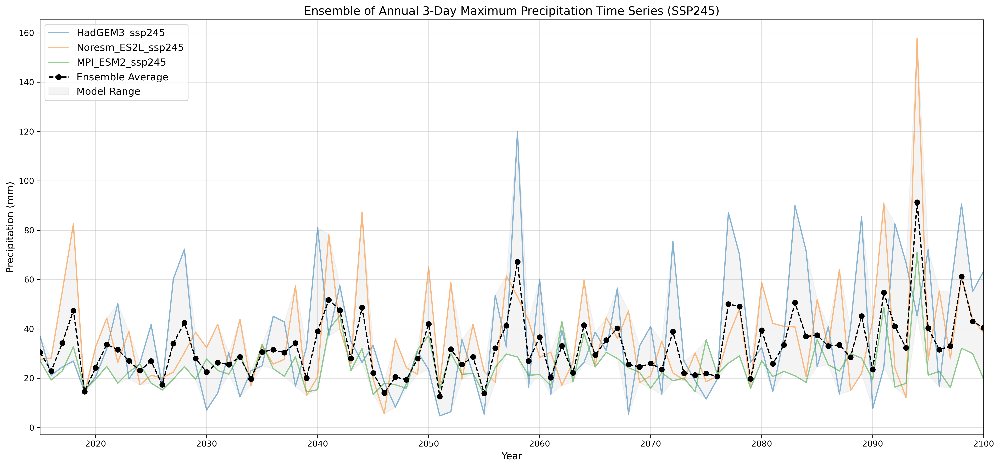
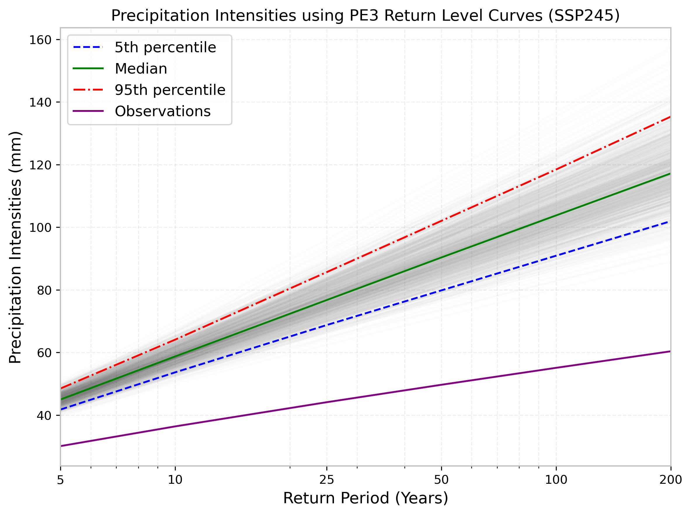

# AMS Return Levels (L-moments) — SSP245

This repository computes **Annual Maximum Series (AMS)** from daily precipitation (3-day rolling sums), fits multiple **L-moment distributions**, selects the **best distribution** using KS + L-moment metrics, and generates **return level curves** with bootstrap uncertainty.


## Example Figures




## Outputs
The pipeline produces:
- AMS time series (models)
- AMS time series (observations)
- Ensemble AMS mean + model spread
- Return level curves (bootstrapped 5th/50th/95th percentiles)
- KS p-values table (CSV)
- Return levels table for each model (CSV)

## Folder structure
- `scripts/` runnable pipeline scripts
- `data/raw/` model inputs (not tracked)
- `data/obs/` observation inputs (not tracked)
- `outputs/` generated figures + metrics (not tracked)
- `docs/figures/` example figures for GitHub preview

## Input format
Each input file is whitespace-delimited with two columns:

YYYY-MM-DD precipitation_value


## Setup (Conda)
```bash
conda env create -f environment.yml
conda activate ams-lmoments
```

## Run

Put your files in:

- data/raw/

- data/obs/

Then run:

```bash
python scripts/run_ssp245_pipeline.py
```
## Notes

- Bootstrap curves are seeded for reproducibility.

- The best distribution is selected automatically (no forcing).


---

## 7) (Optional but very pro) Add a license
Create `LICENSE` (MIT is common). If you want MIT quickly:

- GitHub can generate it when you create the repo, or you can paste MIT text locally.

---

## 8) Test locally before Git
### Create the environment
```bash
conda env create -f environment.yml
conda activate ams-lmoments
```
## Run the script

```bash
python scripts/run_ssp245_pipeline.py
```


